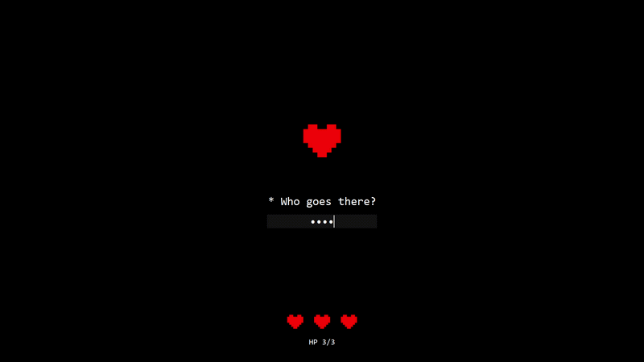

# Heart-gate

A fullscreen passphrase prompt with hit points. Get it wrong and you lose a heart. Lose all three and the heart shatters, the screen reads GAME OVER, and your PC shuts down.

It's a joke, not a security tool. See [Warnings](#warnings).



## What it does

- Runs fullscreen and always-on-top at login, and fights to keep the foreground
- Draws a pixel heart from a text grid — no image files, no dependencies
- Wrong passphrase: screen flash, heart shake, one HP off the counter
- Out of HP: the heart breaks into falling shards, then an optional shutdown

## Requirements

- Windows 10 or 11 (Not tested yet on MacOS or Linux)
- Python 3.8+

No packages to install. Everything it uses — `tkinter`, `ctypes`, `random`, `subprocess`, `sys` — ships with Python.

Open `heart_gate.py` and set `PASSPHRASE` to whatever you want. Everything else is optional.

Press `Ctrl+Shift+Q` to close it while you're experimenting.

## Configuration

All settings live at the top of `heart_gate.py`.

| Setting | Default | What it does |
| --- | --- | --- |
| `PASSPHRASE` | `"changeme"` | What you have to type to get through |
| `MAX_HP` | `3` | How many attempts you get |
| `SHUTDOWN_ENABLED` | `False` | Whether running out of HP actually shuts the PC down |
| `SHUTDOWN_DELAY` | `20` | Seconds before shutdown. Run `shutdown /a` in that window to abort |
| `MSG` | The on-screen text. All of it lives at the top of the file |
| `DEV_ESCAPE` | `True` | Enables the `Ctrl+Shift+Q` escape hatch |
| `KEEP_FOCUS` | `True` | Re-grabs the foreground if another window steals it |
| `HEART`, `PIXEL`, `BIG_PIXEL` | — | The sprite |

Turn `SHUTDOWN_ENABLED` on only after you've watched the death animation a few times and know that `shutdown /a` aborts it.

## Run it at login

Task Scheduler launches earlier than the Startup folder, which has a built-in delay. In PowerShell:

```powershell
$py = (python -c "import sys; print(sys.executable)") -replace 'python\.exe$','pythonw.exe'
$action  = New-ScheduledTaskAction -Execute $py -Argument '"C:\path\to\heart_gate.py"' -WorkingDirectory "C:\path\to"
$trigger = New-ScheduledTaskTrigger -AtLogOn -User "$env:USERNAME"
$set     = New-ScheduledTaskSettingsSet -AllowStartIfOnBatteries -DontStopIfGoingOnBatteries -ExecutionTimeLimit ([TimeSpan]::Zero)
Register-ScheduledTask -TaskName "HeartGate" -Action $action -Trigger $trigger -Settings $set -Force
```

`pythonw.exe` instead of `python.exe` keeps a console window from flashing up.

To remove it:

```powershell
Unregister-ScheduledTask -TaskName "HeartGate" -Confirm:$false
```

It fires on login, not on unlock — `Win+L` and back won't trigger it. To test without rebooting, sign out and back in.

## Getting out

- `Ctrl+Shift+Q` while `DEV_ESCAPE` is on
- `Ctrl+Alt+Del` → Task Manager → end `pythonw.exe`
- Boot holding `Shift` → Restart → Safe Mode, then unregister the task

## Customizing the heart

The sprite is a list of strings. Every `X` becomes one square:

```python
HEART = [
    "  XX  XX  ",
    " XXXXXXXX ",
    " XXXXXXXX ",
    " XXXXXXXX ",
    "  XXXXXX  ",
    "   XXXX   ",
    "    XX    ",
]
```

Edit it in any text editor to change the shape. Every string must be the same length or the columns misalign. `PIXEL` sets the size of the small HP hearts, `BIG_PIXEL` the one in the middle.

Because each square is a separate canvas object, the shatter animation gets to fling them individually — a single image file couldn't do that without pre-drawn fragments.

## Warnings

- **This is not security.** `Ctrl+Alt+Del` bypasses it, Safe Mode ignores it, and the passphrase sits in plain text in the source. Keep your real Windows password on.
- **The shutdown is real.** With `SHUTDOWN_ENABLED = True`, three wrong guesses closes your machine and anything unsaved goes with it. Keep `SHUTDOWN_DELAY` long enough to type `shutdown /a`.
- **Don't put it on someone else's PC.** Software that shuts a machine down without the owner knowing is not a prank, it's a support ticket at best.

## License

MIT — see [LICENSE](LICENSE).
